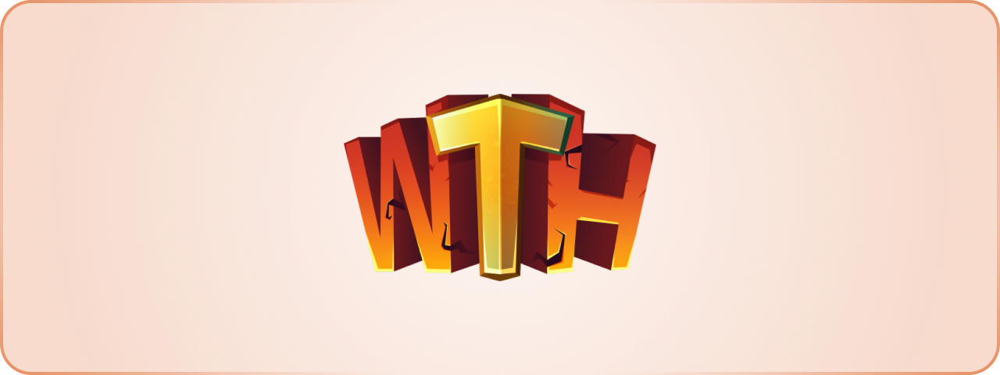

	
    

## Welcome To Hell Summer 2025 Archive

This repository holds the source code for Welcome To Hell's Summer 2025 Engine.
While development has moved beyond this codebase, we believe that there is
value in sharing our lessons from this codebase.

### What is Welcome To Hell?

Welcome To Hell is a punishing tower-obby game focused on fresh, experimental
gameplay and true-to-its-roots inspirations, all woven together with a gripping
narrative.

Welcome To Hell is unreleased as of December 2025, and is aiming for a release
window of summer 2026 to winter 2026.

## Disclaimer

This repository contains source code only. The license applies strictly to the
code and underlying algorithms included here.

All non-code materials, such as art assets, trademarks, audio, and music, 
are intentionally excluded. They remain the property of Team Fireworks and are
not part of this release. Please don’t reach out asking for missing assets;
they are not available and will not be shared.

This repo exists as a behind-the-scenes look at how Welcome To Hell was built.
It is not intended to be a ready-made foundation for your own project. If you’re
looking for a step-by-step guide or advice on turning this into your own game,
good luck.

No technical support is offered for anything in this repository. I hope you are
two steps ahead. Any bugs you encounter are now either your problem, or your
opportunity to prove you should be hired by Team Fireworks. Godspeed.

## License

[ZLib License.](./LICENSE.md)

## Gratitude

Welcome To Hell is thankful for:

-    [Eternal Towers of Hell](https://www.roblox.com/games/8562822414/Eternal-Towers-of-Hell)
     for enabling Team Fireworks to preview the V6 Kit and use it as an early
     reference for Welcome To Hell
-    Other tower games, like Thai's Crazy Towers and Obren's Towers of Hell,
     whom their implementations helped steer Welcome To Hell's API design
